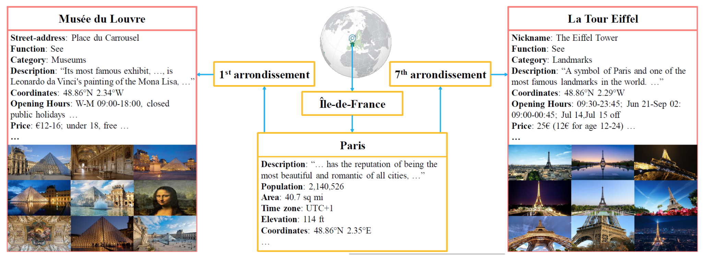

# Placepedia



This repo provides:
1. a large-scale place image dataset with multi-faceted annotations,
2. several benchmarks based on different-level place recognition,
3. a unified framework PlaceNet on multi-level place recognition (will be available later).


## Paper
[Placepedia: Comprehensive Place Understanding with Multi-Faceted Annotations](https://arxiv.org/abs/2007.03777), ECCV 2020 [[Home Page](https://hahehi.github.io/placepedia.html)]


## Requirements
* Python >= 3.6
* PyTorch >= 0.4.0


## Get datasets

1. <strong>All Images (Raw) (14T)</strong> (will be available later)

2. <strong>Meta Data (1.2G)</strong> [Download](https://drive.google.com/file/d/1hTsyMd9hESFD7JOppW6v8QPUx_4tRO_K/view?usp=sharing)

This is the meta data of Placepedia, including two parts: the meta data of location and the caption of place images.

<em>Folder location_side</em>: includes 7 json files for all continents. Contains the hierarchical structure of Placepedia with places from all over the world. Each place is associated with its district, city/town/village, state/province, country. Both administrative areas and places have rich side information, e.g. discription, population, geolocation, category, function, which allows various large-scale studies to be conducted on top of it.

<em>Folder image_caption</em>: includes captions for place images.

3. <strong>Places-Fine (18G)</strong> [Download](https://drive.google.com/file/d/1gLICeacMq3eqaH4NIRaYGxOKNe3BPIHI/view?usp=sharing)

This directory is the dataset of Places-Fine, including five folders and seven meta data, with 1044 places and 290K images. The training/validation/testing set have 444/200/400 places with 110K/60K/120K images respectively, which are tagged with 50 categories, 10 functions, 50 cities, and 34 countries.

<em>Five Image Folders</em>:
Each folder includes several folders with the place name being the directory name; Inside each place folder there are the images of this place.
<p>i. train: includes the places for training.</p>
<p>ii & iii. valg+valq: includes the places for validation for tasks including place categorization, function categorization, and city/country recognition. For place retrieval task, valg includes the gallery images of validation places and valq includes the query images of validation places.</p>
<p>iv & v. testg+testq: includes the places for testing for tasks including place categorization, function categorization, and city/country recognition. For place retrieval task, testg includes the gallery images of testing places and testq includes the query images of testing places.</p>

<em>Four Category Id Files</em>:
<p>i. type_to_id.json: for place categorization task. Each category is associated with an id.</p>
<p>ii. function_to_id.json: for function categorization task. Each function is associated with an id.</p>
<p>iii. city_to_id.json: for city recognition task. Each city is associated with an id.</p>
<p>iv. country_to_id.json: for country recognition task. Each country is associated with an id.</p>

<em>Three Place-Tag Files</em>:
<p>i. train_target_dict.json: place tags for training set.</p>
<p>ii. test_target_dict.json: place tags for testing set.</p>
<p>iii. val_target_dict.json: place tags for validation set.</p>

4. <strong>Places-Coarse (1.7T)</strong> (will be available later)


<!--## Pretrained models
Pretrained models are available in the []().
-->


<!--## Run
-->


## Benchmarks

`place, category, function, city, country` denotes the five task of place recognition: place retrieval, place categorization, function categorization, city recognition, and country recognition.
Details can be found in the paper [Placepedia](https://arxiv.org/pdf/2007.03777.pdf).

| | | Place | Place | Category | Category | Function | Function | City | City | Country | Country |
| ------ | ------ |:-----:|:-----:|:-----:|:-----:|:-----:|:-----:|:-----:|:-----:|:-----:|:-----:|
| | | Top-1 | Top-5 | Top-1 | Top-5 | Top-1 | Top-5 | Top-1 | Top-5 | Top-1 | Top-5 |
| Backbone | AlexNet | 33.78 | 48.19 | 24.16 | 53.03 | 64.97 | 96.70 | 12.47 | 32.52 | 17.97 | 43.30 |
| Backbone | GoogLeNet | 53.48 | 66.23 | 26.01 | 54.81 | 65.69 | 97.20 | 16.34 | 37.19 | 20.98 | 46.43 |
| Backbone | VGG16 | 43.84 | 59.03 | 26.89 | <strong>55.68</strong> | 65.97 | 97.11 | 18.65 | <strong>41.13</strong> | <strong>24.86</strong> | 51.35 |
| Backbone | ResNet50 | 54.53 | 67.01 | 25.22 | 53.62 | <strong>68.25</strong> | 96.89 | 17.15 | 38.55 | 19.72 | 45.51 |
| Pooling | Average | 54.33 | <strong>67.66</strong> | 25.95 | 55.07 | 67.35 | 97.34 | <strong>18.73</strong> | 40.30 | 24.80 | 51.03 |
| Pooling | Max | 49.66 | 63.26 | 25.11 | 54.07 | 65.45 | 97.12 | 16.93 | 38.18 | 22.83 | 48.61 |
| Pooling | SPP | 28.18 | 45.55 | <strong>27.21</strong> | 53.86 | 67.02 | 96.37 | 15.36 | 34.48 | 21.00 | 43.08 |
| Loss | Softmax | 54.31 | <strong>67.66</strong> | 25.95 | 55.07 | 67.35 | 97.34 | <strong>18.73</strong> | 40.30 | 24.80 | 51.03 |
| Loss | Triplet | 50.33 | 64.06 | 21.15 | 48.92 | 64.84 | 95.61 | 14.73 | 36.56 | 20.43 | 46.66 |
| Loss | Focal</strong> | <strong>55.03</strong> | 67.38 | 25.27 | 55.48 | 67.62 | <strong>97.53</strong> | 18.67 | 40.87 | 24.73 | <strong>51.46</strong> |


## License and Citation
The use of this software is RESTRICTED to **non-commercial research and educational purposes**.
```
@inproceedings{Placepedia,
  title={Placepedia: Comprehensive Place Understanding with Multi-Faceted Annotations},
  author={Huang, Huaiyi and Zhang, Yuqi and Huang, Qingqiu and Guo, Zhengkui and Liu, Ziwei and Lin, Dahua},
  booktitle={European Conference on Computer Vision (ECCV)},
  year={2020}
}
```
